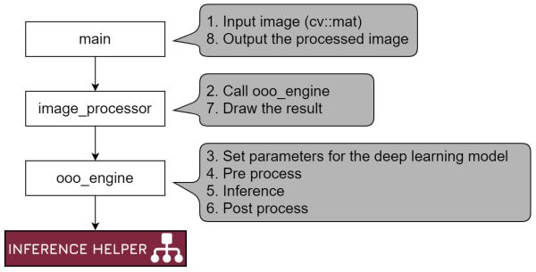

# Play with tflite
- Sample projects to use TensorFlow Lite in C++ for multi-platform
- Typical project structure is like the following diagram
    - 

## Target
- Platform
    - Linux (x64)
    - Linux (armv7)
    - Linux (aarch64)
    - Android (aarch64)
    - Windows (x64). Visual Studio 2019
- Delegate
    - Edge TPU
    - XNNPACK
    - GPU
    - NNAPI(CPU, GPU, DSP)

## Usage
```
./main [input]

 - input = blank
    - use the default image file set in source code (main.cpp)
    - e.g. ./main
 - input = *.mp4, *.avi, *.webm
    - use video file
    - e.g. ./main test.mp4
 - input = *.jpg, *.png, *.bmp
    - use image file
    - e.g. ./main test.jpg
 - input = number (e.g. 0, 1, 2, ...)
    - use camera
    - e.g. ./main 0
```

## How to build a project
### 0. Requirements
- OpenCV 4.x

### 1. Download 
- Download source code and pre-built libraries
    ```sh
    git clone https://github.com/iwatake2222/play_with_tflite.git
    cd play_with_tflite
    git submodule update --init
    sh InferenceHelper/third_party/download_prebuilt_libraries.sh
    ```
- Download models
    ```sh
    sh ./download_resource.sh
    ```

### 2-a. Build in Linux
```sh
cd pj_tflite_cls_mobilenet_v2   # for example
mkdir -p build && cd build
cmake ..
make
./main
```

### 2-b. Build in Windows (Visual Studio)
- Configure and Generate a new project using cmake-gui for Visual Studio 2019 64-bit
    - `Where is the source code` : path-to-play_with_tflite/pj_tflite_cls_mobilenet_v2	(for example)
    - `Where to build the binaries` : path-to-build	(any)
- Open `main.sln`
- Set `main` project as a startup project, then build and run!

### 2-c. Build in Android Studio
- Please refer to
    - https://github.com/iwatake2222/InferenceHelper_Sample#2-d-build-in-android-studio
- Copy `resource` directory to `/storage/emulated/0/Android/data/com.iwatake.viewandroidtflite/files/Documents/resource`
    - the directory will be created after running the app (so the first run should fail because model files cannot be read)
- Modify `ViewAndroid\app\src\main\cpp\CMakeLists.txt` to select a image processor you want to use
    - `set(ImageProcessor_DIR "${CMAKE_CURRENT_LIST_DIR}/../../../../../pj_tflite_cls_mobilenet_v2/image_processor")`
    - replace `pj_tflite_cls_mobilenet_v2` to another
- By default, `InferenceHelper::TENSORFLOW_LITE_DELEGATE_XNNPACK` is used. You can modify `ViewAndroid\app\src\main\cpp\CMakeLists.txt` to select which delegate to use. It's better to use `InferenceHelper::TENSORFLOW_LITE_GPU` to get high performance.
    - You also need to select framework when calling `InferenceHelper::create` .

## Note
### Options (Delegate)
```sh
# Edge TPU
cmake .. -DINFERENCE_HELPER_ENABLE_TFLITE_DELEGATE_EDGETPU=on  -DINFERENCE_HELPER_ENABLE_TFLITE_DELEGATE_GPU=off -DINFERENCE_HELPER_ENABLE_TFLITE_DELEGATE_XNNPACK=off
cp libedgetpu.so.1.0 libedgetpu.so.1
#export LD_LIBRARY_PATH=$LD_LIBRARY_PATH:`pwd`
sudo LD_LIBRARY_PATH=./ ./main
# you may get "Segmentation fault (core dumped)" without sudo

# GPU
cmake .. -DINFERENCE_HELPER_ENABLE_TFLITE_DELEGATE_EDGETPU=off -DINFERENCE_HELPER_ENABLE_TFLITE_DELEGATE_GPU=on  -DINFERENCE_HELPER_ENABLE_TFLITE_DELEGATE_XNNPACK=off
# you may need `sudo apt install ocl-icd-opencl-dev` or `sudo apt install libgles2-mesa-dev`

# XNNPACK
cmake .. -DINFERENCE_HELPER_ENABLE_TFLITE_DELEGATE_EDGETPU=off -DINFERENCE_HELPER_ENABLE_TFLITE_DELEGATE_GPU=off -DINFERENCE_HELPER_ENABLE_TFLITE_DELEGATE_XNNPACK=on

# NNAPI (Note: You use Android for NNAPI. Therefore, you will modify CMakeLists.txt in Android Studio rather than the following command)
cmake .. -DINFERENCE_HELPER_ENABLE_TFLITE_DELEGATE_EDGETPU=off -DINFERENCE_HELPER_ENABLE_TFLITE_DELEGATE_GPU=off -DINFERENCE_HELPER_ENABLE_TFLITE_DELEGATE_XNNPACK=off -DINFERENCE_HELPER_ENABLE_TFLITE_DELEGATE_NNAPI=on
```

You also need to select framework when calling `InferenceHelper::create` .

### EdgeTPU
- Install the following library
    - Linux: https://github.com/google-coral/libedgetpu/releases/download/release-grouper/edgetpu_runtime_20210726.zip
    - Windows: https://github.com/google-coral/libedgetpu/releases/download/release-frogfish/edgetpu_runtime_20210119.zip
        - the latest version doesn't work. If you have already installed `edgetpu_runtime_20210726.zip` , uninstall it. Also uninstall `UsbDk Runtime Libraries` from Windows. Then install `edgetpu_runtime_20210119.zip`
        - it may be better to delete `C:\Windows\System32\edgetpu.dll` to ensure the program uses our pre-built library
- You may need something like the following commands to run the app
    ```sh
    cp libedgetpu.so.1.0 libedgetpu.so.1
    sudo LD_LIBRARY_PATH=./ ./main

    # You may also need the followings beforehand so that you can run X app with sudo via SSH
    touch ~/.Xauthority
    xauth generate :0 . trusted 
    xauth nlist $DISPLAY | sudo xauth nmerge -
    ```

### NNAPI
By default, NNAPI will select the most appropreate accelerator for the model. You can specify which accelerator to use by yourself. Modify the following code in `InferenceHelperTensorflowLite.cpp`

```
// options.accelerator_name = "qti-default";
// options.accelerator_name = "qti-dsp";
// options.accelerator_name = "qti-gpu";
```

# License
- play_with_tflite
- https://github.com/iwatake2222/play_with_tflite
- Copyright 2020 iwatake2222
- Licensed under the Apache License, Version 2.0

# Acknowledgements
- This project utilizes OSS (Open Source Software)
    - [NOTICE.md](NOTICE.md)
- This project utilizes models from other projects:
    - Please find `model_information.md` in resource.zip
