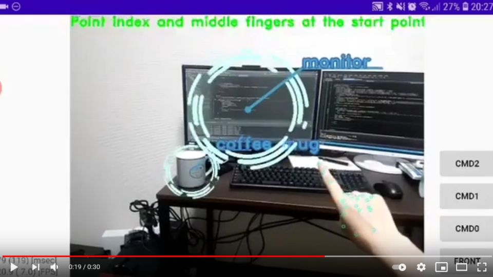

# AR-ish Android Application with TensorFlow Lite in C++
- AR-ish Android Application
- MediaPipe Hand Tracking(Palm Detection + Hand Landmark) + Classification + OpenCV Tracking

Click the image to open in YouTube

## Acknowledgements
- https://github.com/google/mediapipe/tree/master/mediapipe/models/palm_detection.tflite
- https://github.com/google/mediapipe/tree/master/mediapipe/models/hand_landmark.tflite

