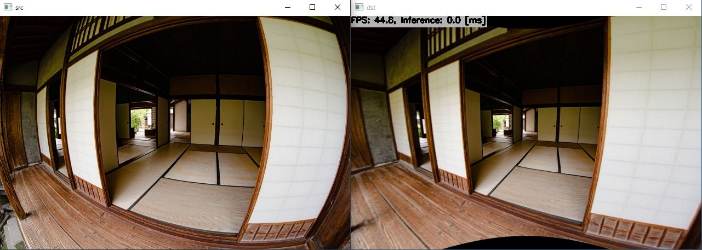

# DeepCalib with TensorFlow Lite in C++

Click the image to open in YouTube. https://youtu.be/RJdSW22dzwM

[](https://youtu.be/RJdSW22dzwM)

## Target Environment, How to Build, How to Run
1. Please follow the instruction: https://github.com/iwatake2222/play_with_tflite/blob/master/README.md
2. Additional steps:
    - Download the model using the following script
        - https://github.com/PINTO0309/PINTO_model_zoo/blob/main/128_DeepCalib/download_regression.sh
        - copy `saved_model/model_float32.tflite` to `resource/model/deep_calib_regresion.tflite`
    - Build  `pj_tflite_camera_deep_calib` project (this directory)

## About App
- Desktop App:
    - Calibration is called when "0" key pressed
    - Undistortion is processed every frame using the estimated parameters
- Android App:
    - Calibration is called when "CMD0" button tapped
    - Undistortion is processed every frame using the estimated parameters

## Acknowledgements
- https://github.com/PINTO0309/PINTO_model_zoo
- https://github.com/alexvbogdan/DeepCalib

```
@inproceedings{bogdan2018deepcalib,
  title={DeepCalib: a deep learning approach for automatic intrinsic calibration of wide field-of-view cameras},
  author={Bogdan, Oleksandr and Eckstein, Viktor and Rameau, Francois and Bazin, Jean-Charles},
  booktitle={Proceedings of the 15th ACM SIGGRAPH European Conference on Visual Media Production},
  year={2018}
}

@inproceedings{xiao2012recognizing,
  title={Recognizing scene viewpoint using panoramic place representation},
  author={Xiao, Jianxiong and Ehinger, Krista A and Oliva, Aude and Torralba, Antonio},
  booktitle={2012 IEEE Conference on Computer Vision and Pattern Recognition},
  year={2012},
}
```