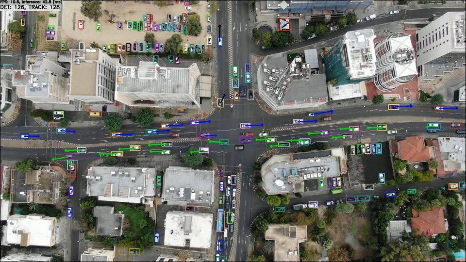

# DroNet with OpenCV(cv::dnn + Darknet) in C++

Click the image to open in YouTube. https://youtu.be/acLZSXB17FM

## Target Environment, How to Build, How to Run
1. Please follow the instruction: https://github.com/iwatake2222/play_with_tflite/blob/master/README.md
2. Additional steps:
    - Download the model
        - https://github.com/gplast/DroNet
        - copy `results/DroNetV3_car.weights` and `cfg/DroNetV3_car.cfg` to `resource/model/`
    - Build  `pj_tflite_det_dronet` project (this directory)

## Note
- To try another model size
    - Modify `width` and `height` in DroNetV3_car.cfg
    - Modify `INPUT_DIMS` in detection_engine.cpp
        - The default value is 608x608. It looks the result is better with 1024x1024

## Notice
- Project with tflite model is under development

## Acknowledgements
- https://github.com/gplast/DroNet
