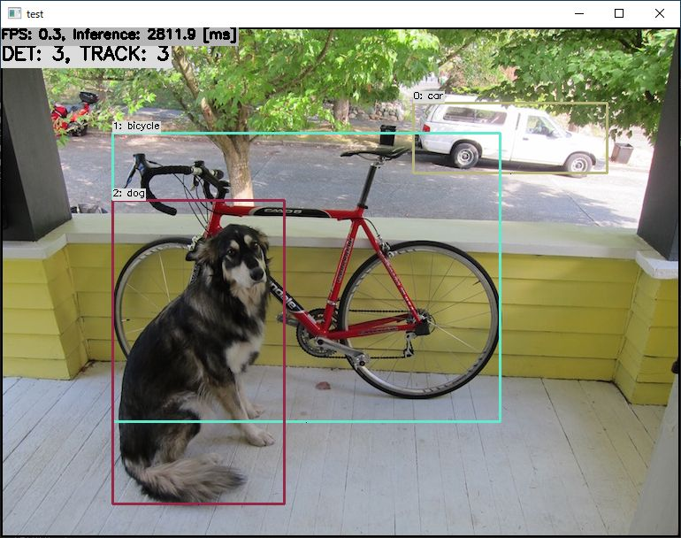

# EfficientDet-Lite with TensorFlow Lite in C++
Sample project to run EfficientDet-Lite

## Target Environment, How to Build, How to Run
1. Please follow the instruction: https://github.com/iwatake2222/play_with_tflite/blob/master/README.md
2. Additional steps:
    - Download the model
        - https://tfhub.dev/tensorflow/lite-model/efficientdet/lite0/detection/metadata/1
        - save the model into `resource/model/lite-model_efficientdet_lite0_detection_metadata_1.tflite`
    - Build  `pj_tflite_det_efficientdet_lite` project (this directory)

## Acknowledgements
- https://tfhub.dev/tensorflow/lite-model/efficientdet/lite0/detection/metadata/1
