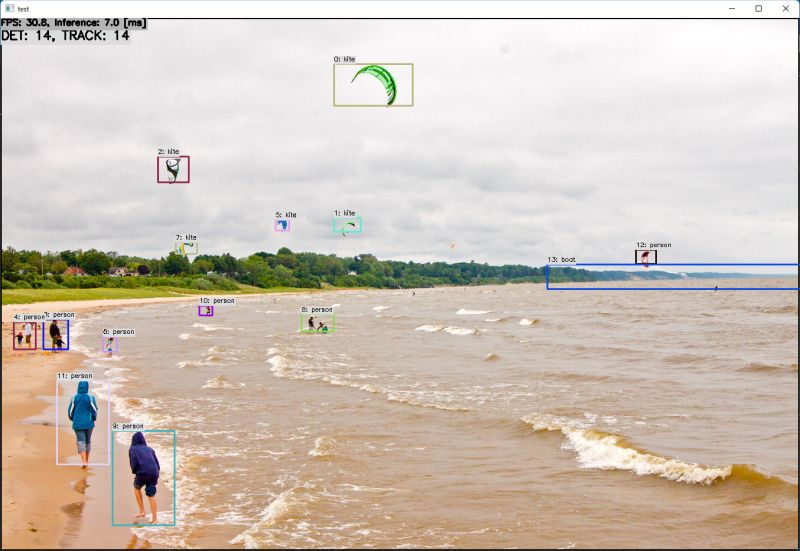

# FastestDet with TensorFlow Lite in C++
Sample project to run FastestDet + SORT

## How to Run
1. Please follow the instruction: https://github.com/iwatake2222/play_with_tflite/blob/master/README.md
2. Additional steps:
    - Download the model using the following script
        - https://github.com/PINTO0309/PINTO_model_zoo/blob/main/308_FastestDet/download_openvino_oak_myriad_tf_tflite_tfjs_coreml.sh
        - copy `fastestdet_352x640/model_float32.tflite` to `resource/model/fastestdet_352x640.tflite`
    - Build  `pj_tflite_det_fastestdet` project (this directory)

## Acknowledgements
- https://github.com/dog-qiuqiu/FastestDet
- https://github.com/PINTO0309/PINTO_model_zoo
