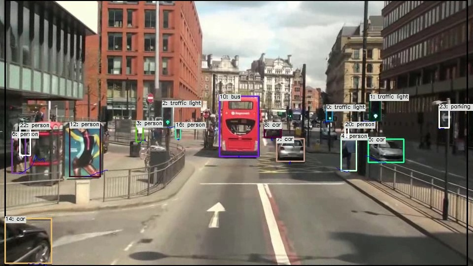

# YOLOv5 with TensorFlow Lite in C++
Sample project to run YOLOv5 + SORT

Click the image to open the video in YouTube

## Target Environment, How to Build, How to Run
1. Please follow the instruction ( https://github.com/iwatake2222/play_with_tflite/blob/master/README.md )
2. Additional steps:
    - Download the model using the following script
        - https://github.com/PINTO0309/PINTO_model_zoo/blob/main/059_yolov5/22_yolov5s_new/download.sh
        - copy `saved_model_480x640/model_float32.tflite` to `resource/model/yolov5_480x640.tflite`
    - Place  `resource/kite.jpg` and `resource/model/label_coco_80.txt`
        - https://user-images.githubusercontent.com/11009876/128452081-4ea8e635-5085-4d9f-b95f-cb4fb7475900.jpg
        - https://github.com/iwatake2222/play_with_tflite/files/6938693/label_coco_80.txt
    - Build  `pj_tflite_det_yolov5` project (this directory)

## Play more ?
- The project here uses very basic model and settings
- You can run the project on Windows, Linux (x86_64), Linux (ARM) and Android
- You can try another model such as bigger input size, quantized model, etc.:
    - Please modify `Model parameters` part in `detection_engine.cpp`
- You can try TensorFlow Lite with delegate
    - Please modify `Create and Initialize Inference Helper` part in `detection_engine.cpp` and cmake option
- You can try another inference engine like OpenCV, TensorRT, etc.
    - Please modify `Create and Initialize Inference Helper` part in `detection_engine.cpp` and cmake option

## Acknowledgements
- https://github.com/ultralytics/yolov5
- https://github.com/PINTO0309/PINTO_model_zoo

