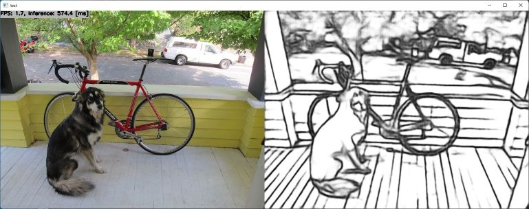

# Edge detection using DexiNed (Dense Extreme Inception Network for Edge Detection) with TensorFlow Lite in C++
Sample project to run DexiNed

## How to Run
1. Please follow the instruction: https://github.com/iwatake2222/play_with_tflite/blob/master/README.md
2. Additional steps:
    - Download the model using the following script
        - https://github.com/PINTO0309/PINTO_model_zoo/blob/main/229_DexiNed/download.sh
        - copy `dexined_320x480/model_float32.tflite` to `resource/model/dexined_320x480.tflite`
    - Build  `pj_tflite_edge_dexined` project (this directory)

## Acknowledgements
- https://github.com/xavysp/DexiNed
- https://github.com/PINTO0309/PINTO_model_zoo
