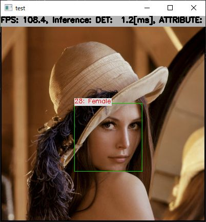

# Age/Gender Recognition with TensorFlow Lite in C++

## Target Environment, How to Build, How to Run
1. Please follow the instruction: https://github.com/iwatake2222/play_with_tflite/blob/master/README.md
2. Additional steps:
    - Download the face detection model
        - https://github.com/iwatake2222/play_with_tflite/blob/master/pj_tflite_face_blazeface
    - Download the model using the following script
        - https://github.com/PINTO0309/PINTO_model_zoo/blob/main/070_age-gender-recognition/01_float32/download.sh
        - copy `model_float32.tflite` to `resource/model/age-gender-recognition.tflite`
    - Build  `pj_tflite_face_age-gender-recognition` project (this directory)

## Acknowledgements
- https://github.com/openvinotoolkit/open_model_zoo/tree/master/models/intel/age-gender-recognition-retail-0013
- https://github.com/PINTO0309/PINTO_model_zoo
