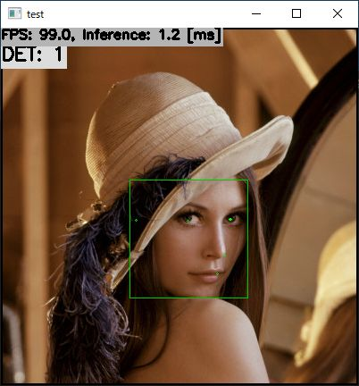

# BlazeFace with TensorFlow Lite in C++
Sample project to run BlazeFace

## Target Environment, How to Build, How to Run
1. Please follow the instruction: https://github.com/iwatake2222/play_with_tflite/blob/master/README.md
2. Additional steps:
    - Download the model using the following script (for an old model)
        - https://github.com/PINTO0309/PINTO_model_zoo/blob/main/030_BlazeFace/01_float32/download.sh
        - copy `face_detection_front.tflite` to `resource/model/face_detection_front.tflite`
    - Download the model using the following script (for new models)
        - https://github.com/PINTO0309/PINTO_model_zoo/blob/main/030_BlazeFace/01_float32/download_new.sh
        - copy `face_detection_front_128x128_float32.tflite` to `resource/model/face_detection_front_128x128_float32.tflite`
        - copy `face_detection_back_256x256_float32.tflite` to `resource/model/face_detection_back_256x256_float32.tflite`
    - Build  `pj_tflite_face_blazeface` project (this directory)

## Note
- The project uses the old model by default
- If you want to use the new models, please change ifdef switch in `face_detection_engine.cpp`
    - `MODEL_TYPE_128x128_CONCAT`
    - `MODEL_TYPE_128x128`
    - `MODEL_TYPE_256x256`

## Acknowledgements
- https://github.com/google/mediapipe
- https://github.com/PINTO0309/PINTO_model_zoo
