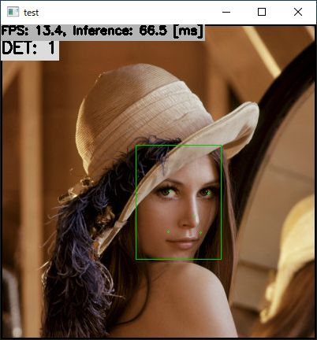

# DBFace with TensorFlow Lite in C++
Sample project to run DBFace

## Target Environment, How to Build, How to Run
1. Please follow the instruction: https://github.com/iwatake2222/play_with_tflite/blob/master/README.md
2. Additional steps:
    - Download the model using the following script
        - https://github.com/PINTO0309/PINTO_model_zoo/blob/main/041_DBFace/21_mobilenetv2/download.sh
        - copy `saved_model_480x640/model_float32.tflite` to `resource/model/dbface_mbnv2_480x640.tflite`
    - Build  `pj_tflite_face_dbface` project (this directory)

## Acknowledgements
- https://github.com/dlunion/DBFace
- https://github.com/PINTO0309/PINTO_model_zoo
