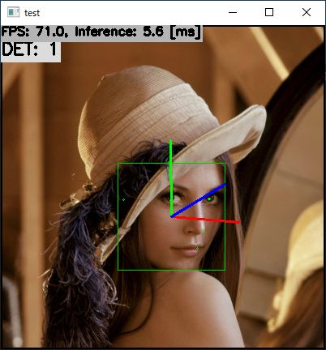

# Head Pose Estimation with TensorFlow Lite in C++
Sample project to run Head Pose Estimation

## Target Environment, How to Build, How to Run
1. Please follow the instruction: https://github.com/iwatake2222/play_with_tflite/blob/master/README.md
2. Additional steps:
    - Download the face detection model
        - https://github.com/iwatake2222/play_with_tflite/blob/master/pj_tflite_face_blazeface
    - Download the model using the following script
        - https://github.com/PINTO0309/PINTO_model_zoo/blob/main/134_head-pose-estimation-adas-0001/download.sh
        - copy `saved_model/model_float32.tflite` to `resource/model/head-pose-estimation-adas-0001.tflite`
    - Build  `pj_tflite_face_head-pose-estimation-adas-0001` project (this directory)

## Note
- This model outputs Tait-Bryan angles
- To draw estiamted angle axes on the input image, you need to set camera parameters
    - If the camera parameters are incorrect, the output may look wrong
    - The fixed values are implemented in code ( `image_processor.cpp` ) . please modify them for your environment

## Acknowledgements
- https://github.com/openvinotoolkit/open_model_zoo/tree/master/models/intel/head-pose-estimation-adas-0001
- https://github.com/PINTO0309/PINTO_model_zoo
