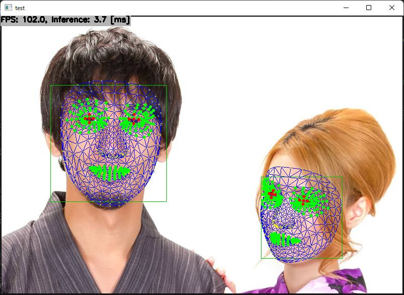

# Attention Mesh Model (Face Landmark with Attention) with TensorFlow Lite in C++

## Target Environment, How to Build, How to Run
1. Please follow the instruction: https://github.com/iwatake2222/play_with_tflite/blob/master/README.md
2. Additional steps:
    - Download the face detection model
        - https://github.com/iwatake2222/play_with_tflite/blob/master/pj_tflite_face_blazeface
    - Download the model using the following script
        - https://github.com/PINTO0309/PINTO_model_zoo/blob/main/282_face_landmark_with_attention/download.sh
        - copy `model_float32.tflite` to `resource/model/face_landmark_with_attention.tflite`
    - Build  `pj_tflite_face_landmark_with_attention` project (this directory)

## Note
- When a face is rotated, accuracy may be decreased. It's because a rotation pre-process for mesh model is not implemented in this project to make the code simple.

## Acknowledgements
- https://github.com/google/mediapipe
- https://github.com/PINTO0309/PINTO_model_zoo
