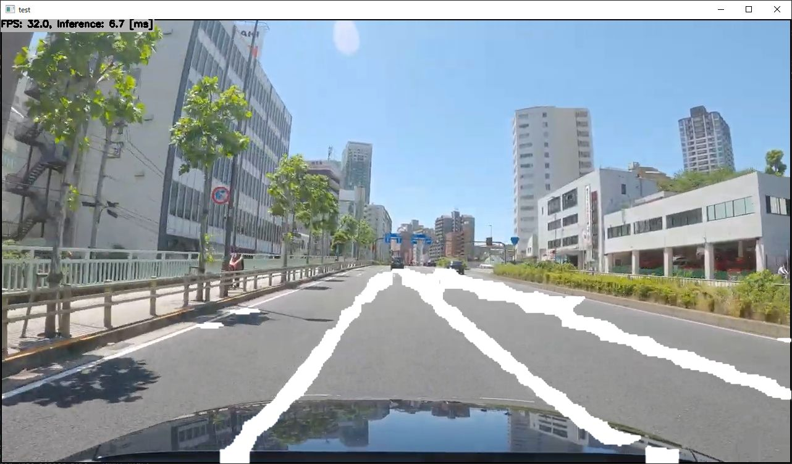

# LaneNet-Lane-Detection with TensorFlow Lite in C++

- Post process like line fitting is not implemented. Just drawing binary segmentation image
- Original video image is https://www.youtube.com/watch?v=tTuUjnISt9s (Copyright Dashcam Roadshow 2020)

## Target Environment, How to Build, How to Run
1. Please follow the instruction: https://github.com/iwatake2222/play_with_tflite/blob/master/README.md
2. Additional steps:
    - Download the model using the following script
        - https://github.com/PINTO0309/PINTO_model_zoo/blob/main/141_lanenet-lane-detection/download.sh
        - copy `saved_model/model_float32.tflite` to `resource/model/lanenet-lane-detection.tflite`
    - Build  `pj_tflite_lane_lanenet-lane-detection` project (this directory)

## Acknowledgements
- https://github.com/PINTO0309/PINTO_model_zoo
- https://github.com/xuanyuyt/lanenet-lane-detection
