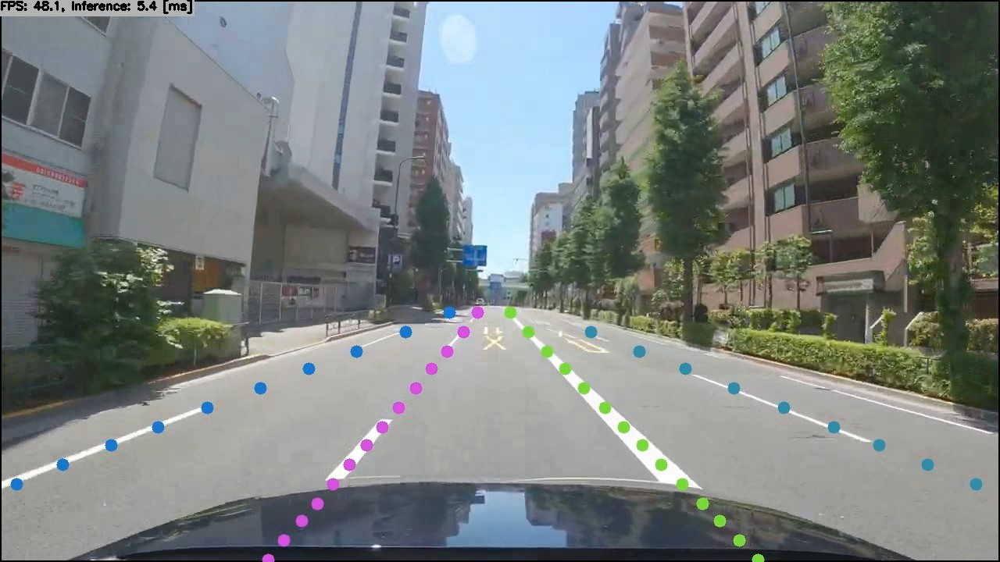

# Ultra-Fast-Lane-Detection with TensorFlow Lite in C++

Click the image to open in YouTube. https://youtu.be/lvKY1wjpo98

[](https://youtu.be/lvKY1wjpo98)

Original video image is https://www.youtube.com/watch?v=tTuUjnISt9s (Copyright Dashcam Roadshow 2020)

## Target Environment, How to Build, How to Run
1. Please follow the instruction: https://github.com/iwatake2222/play_with_tflite/blob/master/README.md
2. Additional steps:
    - Download the model using the following script
        - https://github.com/PINTO0309/PINTO_model_zoo/blob/main/140_Ultra-Fast-Lane-Detection/download_culane.sh
        - copy `saved_model_culane/model_float32.tflite` to `resource/model/ultra_fast_lane_detection_culane_288x800.tflite`
    - Build  `pj_tflite_lane_ultra-fast-lane-detection` project (this directory)

## Acknowledgements
- https://github.com/PINTO0309/PINTO_model_zoo
- https://github.com/cfzd/Ultra-Fast-Lane-Detection

```BibTeX
@InProceedings{qin2020ultra,
author = {Qin, Zequn and Wang, Huanyu and Li, Xi},
title = {Ultra Fast Structure-aware Deep Lane Detection},
booktitle = {The European Conference on Computer Vision (ECCV)},
year = {2020}
}
```