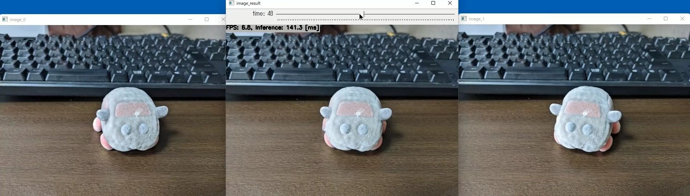

https://user-images.githubusercontent.com/11009876/154783543-852c7281-dbe4-46bf-8323-ed279316d7b7.mp4

# FILM (Frame Interpolation for Large Scene Motion) with TensorFlow Lite in C++
Sample project for FILM (Frame Interpolation for Large Scene Motion)

## How to Run
1. Please follow the instruction: https://github.com/iwatake2222/play_with_tflite/blob/master/README.md
2. Additional steps:
    - Download the model using the following script
        - https://github.com/PINTO0309/PINTO_model_zoo/blob/main/255_FILM/download_VGG.sh
        - copy `film_net_VGG_480x640/model_float32.tflite` to `resource/model/film_net_VGG_480x640.tflite`
        - copy `film_net_VGG_480x640/model_float32.onnx` to `resource/model/film_net_VGG_480x640.onnx`
    - Build  `pj_tflite_other_film` project (this directory)

- Note: this model is very heavy, so using TensorRT is recommended
    - https://github.com/iwatake2222/play_with_tensorrt/tree/master/pj_tensorrt_other_film

## Acknowledgements
- https://github.com/google-research/frame-interpolation
- https://github.com/PINTO0309/PINTO_model_zoo

