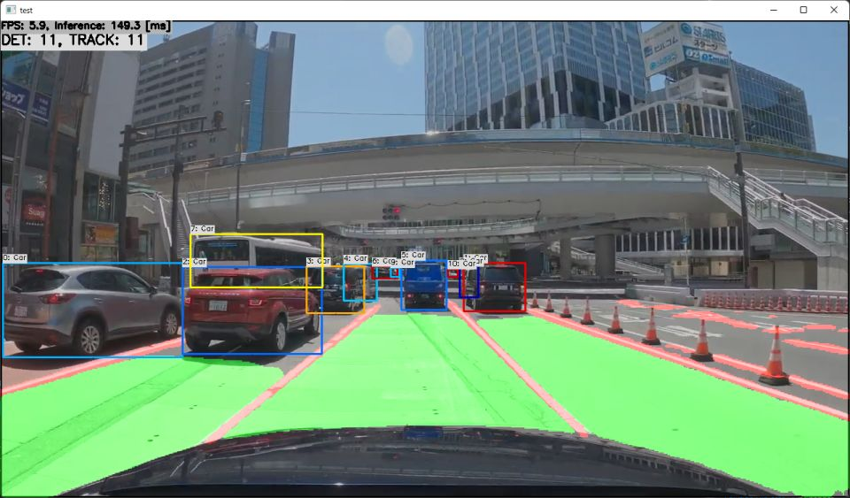

# HybridNets with TensorFlow Lite / ONNX Runtime in C++

https://user-images.githubusercontent.com/11009876/161028698-0011d920-1257-4203-95ba-ef3ab5a00b85.mp4

https://user-images.githubusercontent.com/11009876/161028473-014ed73c-b0d9-46fd-bf85-4ced71a00a74.mp4

## How to Run
1. Please follow the instruction: https://github.com/iwatake2222/play_with_tflite/blob/master/README.md
2. Additional steps:
    - Download the model using the following script
        - https://github.com/PINTO0309/PINTO_model_zoo/blob/main/276_HybridNets/download.sh
        - copy `hybridnets_384x640/model_float32.tflite` to `resource/model/hybridnets_384x640.tflite`
        - copy `hybridnets_384x640/hybridnets_384x640.onnx` to `resource/model/hybridnets_384x640.onnx`
    - Build  `pj_tflite_perception_hybrid_nets` project (this directory)

## Note
- By default it uses tflite model. If you want to use onnx model please change ifdef switch in `detection_engine.cpp`
    - `#define MODEL_TYPE_TFLITE`
    - `#define MODEL_TYPE_ONNX`
- The processed videos are created with RTX 3060Ti(ONNX Runtime + CUDA) and with Pixel 4a(tflite + GPU + FP16)

## Acknowledgements
- https://github.com/datvuthanh/HybridNets
- https://github.com/PINTO0309/PINTO_model_zoo
- Drive Video by Dashcam Roadshow
    - 4K東京ドライブ: 明治通りから国道1号 19km（池袋→新宿→渋谷→五反田）
    - https://www.youtube.com/watch?v=tTuUjnISt9s
