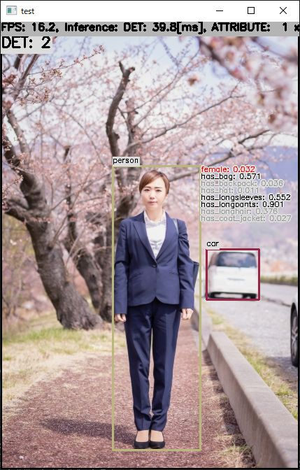

# Person Attributes Recognition with TensorFlow Lite in C++

## Target Environment, How to Build, How to Run
1. Please follow the instruction: https://github.com/iwatake2222/play_with_tflite/blob/master/README.md
2. Additional steps:
    - Download the YOLOX model using the following script
        - https://github.com/PINTO0309/PINTO_model_zoo/blob/main/132_YOLOX/download_nano_new.sh
        - copy `saved_model_yolox_nano_480x640/model_float32.tflite` to `resource/model/yolox_nano_480x640.tflite`
    - Download the person-attributes-recognition model using the following script
        - https://github.com/PINTO0309/PINTO_model_zoo/blob/main/124_person-attributes-recognition-crossroad-0230/download.sh
        - copy `saved_model/model_float32.tflite` to `resource/model/person-attributes-recognition-crossroad-0230.tflite`
    - Build  `pj_tflite_person-attributes-recognition-crossroad-0230` project (this directory)

## Acknowledgements
- https://github.com/openvinotoolkit/open_model_zoo/tree/master/models/intel/person-attributes-recognition-crossroad-0230
- https://github.com/PINTO0309/PINTO_model_zoo

