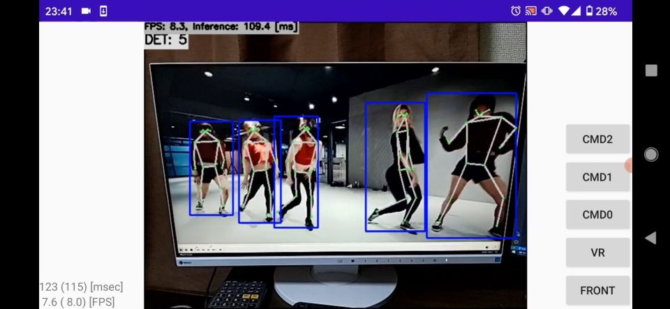

# Pose estimation (movenet/multipose/lightning) with TensorFlow Lite in C++
Sample project to run Pose estimation

Click the image to open in YouTube. https://youtu.be/6f1jN-uZVwQ

## Target Environment, How to Build, How to Run
1. Please follow the instruction: https://github.com/iwatake2222/play_with_tflite/blob/master/README.md
2. Additional steps:
    - Download the model using the following script
        - https://github.com/PINTO0309/PINTO_model_zoo/blob/main/137_MoveNet_MultiPose/download_multipose_lightning.sh
        - copy `saved_model_256x256/model_float32.tflite` to `resource/model/movenet_multipose_256x256_lightning.tflite`
    - Build  `pj_tflite_pose_movenet_multi` project (this directory)

## Acknowledgements
- https://tfhub.dev/google/movenet/multipose/lightning/1
- https://github.com/PINTO0309/PINTO_model_zoo

