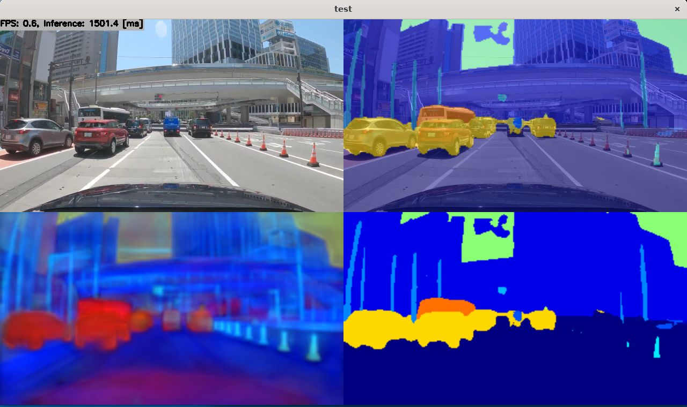

# Segmentation using PaddleSeg CityscapesSOTA with TensorFlow Lite in C++
Sample project for PaddleSeg CityscapesSOTA (The implementation of Hierarchical Multi-Scale Attention based on PaddlePaddle)

## How to Run
1. Please follow the instruction: https://github.com/iwatake2222/play_with_tflite/blob/master/README.md
2. Additional steps:
    - Download the model using the following script
        - https://github.com/PINTO0309/PINTO_model_zoo/blob/main/201_CityscapesSOTA/download.sh
        - copy `saved_model_180x320/model_float32.tflite` to `resource/model/paddleseg_cityscapessota_180x320.tflite`
    - Build  `pj_tflite_seg_paddleseg_cityscapessota` project (this directory)

- Note: this model is very heavy, so using TensorRT is recommended
    - https://github.com/iwatake2222/play_with_tensorrt/tree/master/pj_tensorrt_seg_paddleseg_cityscapessota

### Tested environment
- Windows 11
    - Core i7-11700 @ 2.5GHz x 8 cores (16 processors)
    - Visual Studio 2019
- Linux (WSL2 on Windows11)
    - Core i7-11700 @ 2.5GHz x 8 cores (16 processors)
    - Ubuntu 20.04 (5.10.16.3-microsoft-standard-WSL2)
- Linux
    - Jetson Xavier NX
    - JetPack 4.6
- Linux
    - Android
    - Pixel 4a

## Acknowledgements
- https://github.com/PaddlePaddle/PaddleSeg/tree/release/2.3/contrib/CityscapesSOTA
- https://github.com/PINTO0309/PINTO_model_zoo
- Test image
    - Drive Video by Dashcam Roadshow
    - 4K東京ドライブ: 明治通りから国道1号 19km（池袋→新宿→渋谷→五反田）
    - https://www.youtube.com/watch?v=tTuUjnISt9s
    - around 15:06

