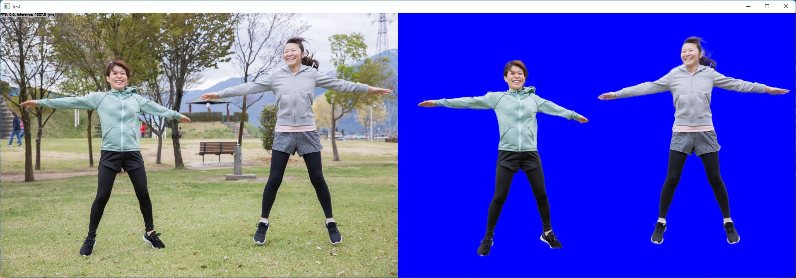

# Robust Video Matting (RVM) with TensorFlow Lite in C++

https://user-images.githubusercontent.com/11009876/151349607-788f6b2f-df87-42ac-a953-9d27a21d7f06.mp4

* Demo Video is created with TensorRT

## How to Run
1. Please follow the instruction: https://github.com/iwatake2222/play_with_tflite/blob/master/README.md
2. Additional steps:
    - Download the model using the following script
        - https://github.com/PINTO0309/PINTO_model_zoo/blob/main/242_RobustVideoMatting/download_resnet50.sh
        - copy `rvm_resnet50_720x1280/model_float32.tflite` to `resource/model/rvm_resnet50_720x1280.tflite`
    - Build  `pj_tflite_seg_robust_video_matting` project (this directory)

* You can also try another model. Please modify model parameters in segmentation_engine.cpp

## Acknowledgements
- https://github.com/PeterL1n/RobustVideoMatting
- https://github.com/PINTO0309/PINTO_model_zoo
- Test image
    - Dj Allu Arjun Dance On Nagpuri Dj Song 2017 Latest by entertainment poker (Creative Commons)
    - https://www.youtube.com/watch?v=wlU2wDiP0ak
