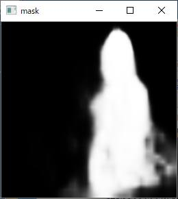

# PersonMask_TFLite

30～40fps @ Windows 10 (Intel i7-6700 @ 3.4GHz x 1-core)

## How to build
1. Please follow the instruction ( https://github.com/iwatake2222/play_with_tflite/blob/master/README.md )
2. Download the model(mobilenet_v3_segm_256.tflite) from https://github.com/NikolasEnt/PersonMask_TFLite
3. Copy to resource/model directory

## Acknowledgements
- https://github.com/NikolasEnt/PersonMask_TFLite
- https://www.pakutaso.com/20200735191post-29364.html
