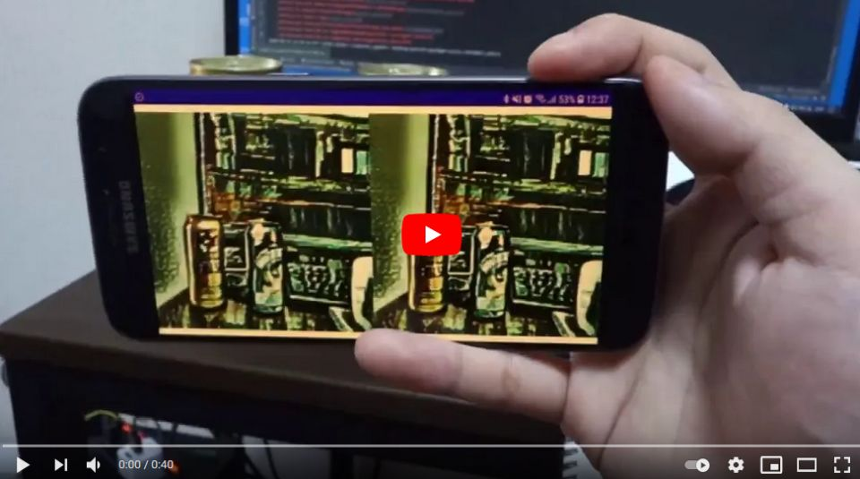

# Artistic Style Transfer with TensorFlow Lite in C++
Sample project to run Artistic Style Transfer

Click the image to open in YouTube

## Acknowledgements
- https://tfhub.dev/google/lite-model/magenta/arbitrary-image-stylization-v1-256/fp16/prediction/1
- https://tfhub.dev/google/lite-model/magenta/arbitrary-image-stylization-v1-256/fp16/transfer/1