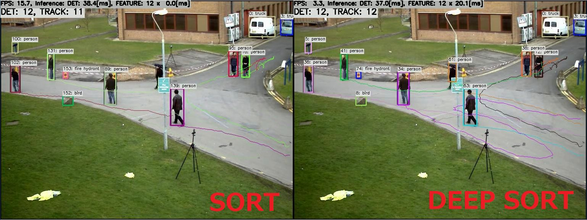

# YOLOX-Nano + Deep SORT with TensorFlow Lite in C++
Sample project to run YOLOX-Nano + Deep SORT

Click the image to open in YouTube. https://youtu.be/7BtEOCb3wMk

## Target Environment, How to Build, How to Run
1. Please follow the instruction: https://github.com/iwatake2222/play_with_tflite/blob/master/README.md
2. Additional steps:
    - Download the YOLOX model using the following script
        - https://github.com/PINTO0309/PINTO_model_zoo/blob/main/132_YOLOX/download_nano_new.sh
        - copy `saved_model_yolox_nano_480x640/model_float32.tflite` to `resource/model/yolox_nano_480x640.tflite`
    - Download the Deep SORT model using the following script
        - https://github.com/PINTO0309/PINTO_model_zoo/blob/main/087_DeepSort/download.sh
        - copy `model_float32.tflite` to `resource/model/deepsort_128x64.tflite`
    - Place  `resource/kite.jpg` and `resource/model/label_coco_80.txt`
        - https://user-images.githubusercontent.com/11009876/128452081-4ea8e635-5085-4d9f-b95f-cb4fb7475900.jpg
        - https://github.com/iwatake2222/play_with_tflite/files/6938693/label_coco_80.txt
    - Build  `pj_tflite_track_deepsort` project (this directory)

## Note
- There is a large space can be improved in tracking algorithm

## Acknowledgements
- https://arxiv.org/abs/1703.07402
- https://github.com/mikel-brostrom/Yolov5_DeepSort_Pytorch
- https://github.com/Megvii-BaseDetection/YOLOX
- https://github.com/PINTO0309/PINTO_model_zoo

## メモ
- SORT
  - 〇: 別の人との取り違えは無い (2回以上トラッキングに失敗したら消すので当然といえば当然)
  - ×: オクルージョンなどが発生したらトラッキングは途切れる
- Deep Sort
  - 〇: オクルージョンが発生してもトラッキングし続ける
  - ×: たまに別の人と取り違える (featureが似ている)
        - 見た目が全然別でも類似度が高くなることがある
        - とはいえ、SORTでトラッキング削除の閾値を2回から数十回に増やした場合よりかは良い
  - ×: 処理時間がオブジェクト数に比例して増加
